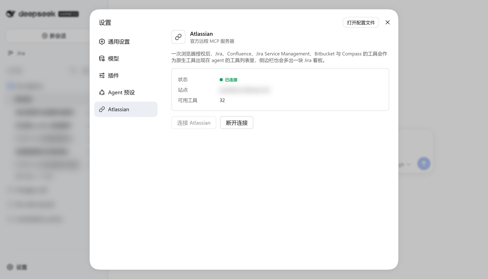
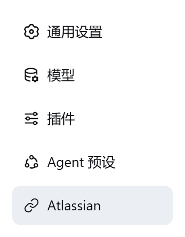

# dsh-plugin-atlassian

[](LICENSE)

[中文](README.md) · **English**

Bridges **Atlassian's official remote MCP server** into
[DeepSeek Harness](https://www.npmjs.com/package/@deepseek-ai/dsh). After a single browser
authorization, the Jira, Confluence, Jira Service Management, Bitbucket and Compass tools appear
as native tools in the agent's tool list:

```
mcp__atlassian__getJiraIssue
mcp__atlassian__createJiraIssue
mcp__atlassian__searchConfluenceUsingCql
```



## Features

- 🔐 **OAuth 2.1 authorization** — dynamic client registration + PKCE + loopback callback.
  Credentials (including the refresh token) are stored in `$DSH_HOME/.dsh-atlassian/` with mode
  `0600`, so restarts do not require re-authorizing
- 🚫 **No `cloudId`** — the site is decided by the authorization, so no tool call has to pass one
- 🖥️ **Settings page** — shows connection status, the authorized site and the tool count, and
  offers Connect / Disconnect plus a manual authorization link
- 🧩 **Tool naming matches the built-in convention** — `mcp__<serverName>__<rawName>`, so session
  history and permission rules stay valid across restarts
- 🔍 **Optional site check** — with `expectedSite` configured, the actual site is compared once
  authorization completes and a mismatch is surfaced in Settings
- 🙈 **No browser popup on activation** — the background connection attempt at profile start never
  steals focus

## Install

```sh
dsh plugin --profile desktop add dsh-plugin-atlassian
```

**Restart that profile afterwards** (the bundle layer is cached in-process). Replace `desktop` with
the profile you actually use.

<details>
<summary>Installing from a local checkout (before the npm release)</summary>

Link this repository into the target profile's `node_modules`:

```powershell
$profileDir = "$env:USERPROFILE\.dsh\profiles\desktop"

New-Item -ItemType Junction `
  -Path "$profileDir\node_modules\dsh-plugin-atlassian" `
  -Target "<absolute path to this repository>"
```

Then confirm the plugin row is present and restart the profile.

> Build once after cloning: `npm install && npm run build`. When installed from git via
> `dsh plugin add`, the bundled `prepare` script builds it automatically.

</details>

## Usage

1. Open **Settings → Atlassian**
2. Click **Connect Atlassian** (the button reads **Open authorization page** while authorization is
   pending)
3. Approve the request on Atlassian's authorization page, **choosing the site to authorize**
4. Return to DSH — the status becomes **Connected** and the tools are available

> The site is entirely your choice on the authorization page; the plugin neither presets nor picks
> one for you. If the page does not open automatically, Settings shows a clickable authorization
> link. If the flow gets stuck, click **Disconnect** and reconnect.

## Configuration

The plugin row comes from the `cordis.patch.yml` shipped inside the package. To change it, override
by `id` in your profile's `cordis.patch.yml` (a patch **replaces the row's whole `config`** rather
than merging, so restate the other fields too):

```yaml
- id: atlassian
  config:
    serverName: atlassian
    url: https://mcp.atlassian.com/v1/mcp
    redirectPort: 3334
    expectedSite: your-site.atlassian.net
    toolCallTimeoutMs: 60000
    authorizationTimeoutMs: 300000
    autoOpenBrowser: true
```

| Field | Default | Meaning |
|---|---|---|
| `serverName` | `atlassian` | Tool-name prefix: `mcp__<serverName>__<tool>` |
| `url` | `https://mcp.atlassian.com/v1/mcp` | Remote MCP endpoint (the older `/v1/sse` is deprecated) |
| `redirectPort` | `3334` | Loopback port for the OAuth callback; `0` lets the system assign one |
| `expectedSite` | empty | Expected site. When set, it is checked after authorization and a mismatch is reported in Settings |
| `toolCallTimeoutMs` | `60000` | Timeout for one tool call |
| `authorizationTimeoutMs` | `300000` | How long to wait for the browser to finish authorization |
| `autoOpenBrowser` | `true` | Open the browser when **Connect Atlassian** is clicked. Activation attempts **never** open one |

> ⚠️ Keep `redirectPort` stable. Dynamic client registration binds the redirect URI into the stored
> registration, so a changed port invalidates it. The plugin detects this and re-registers (it does
> not fail silently), but that costs an extra round trip.

> 📌 `expectedSite` is **deliberately empty** in the packaged `cordis.patch.yml`. That patch ships
> inside the npm package and is every installer's default; pinning a real site there would show a
> bogus "site mismatch" notice to everyone else. Site-specific values belong to the deployment — set
> yours in your own profile's `cordis.patch.yml`.
>
> `expectedSite` is only used for **display and a post-hoc check**; it does not take part in site
> selection. If a token grants several sites, Settings shows the first one from the resource list,
> so treat that label as indicative only.

## Tool naming

Follows the DSH built-in MCP client convention:

```
mcp__<serverName>__<rawName>
```

Names longer than 64 characters, or containing illegal characters, are truncated with a 12-character
SHA-256 suffix, so two different MCP tools never collapse into the same name. Sharing the convention
keeps session history and permission rules valid across restarts, and lets plugins such as
`dsh-context` tag them as `mcp:atlassian`.

## Uninstall

```sh
dsh plugin --profile desktop remove dsh-plugin-atlassian
```

Then remove the stored authorization:
`Remove-Item "$env:USERPROFILE\.dsh\.dsh-atlassian\*.json"`.

## Troubleshooting

<details>
<summary>No Atlassian page in Settings</summary>

The profile has no web server service, or the plugin did not take effect with the profile restart.
Check the startup log for warnings prefixed with `atlassian:`. `dsh --profile <name> --dump-config`
shows whether the row is really in the composition.
</details>

<details>
<summary>Stuck at "Authorization required", or the browser never opened</summary>

Settings shows a clickable authorization link — use it directly. If `redirectPort` is taken by
something else, the plugin falls back to a temporary port and re-registers automatically. If the flow
is truly stuck, click **Disconnect** to clear the token and reconnect.
</details>

<details>
<summary>Connected, but the tool count is 0</summary>

The server returned no tools, usually a site permission issue. Look for
`atlassian: connected ... 0 tool(s)` in the log, and confirm the site you authorized gives access to
the products you expect.
</details>

<details>
<summary>Still told "not authorized" after approving</summary>

Click **Disconnect** in Settings to clear the token, then connect again.
</details>

<details>
<summary>Settings reports a site mismatch</summary>

The `expectedSite` in your profile does not match the site actually authorized. The tools still work,
but they point at the site shown in Settings. Either fix `expectedSite` or re-authorize the intended
site. **This is a notice, not a block.**
</details>

## Known limitations

- **Tools only.** There is no consumption mechanism for MCP Resources or Prompts yet.
- **Image results render as placeholder text.** Only text blocks are projected to the model today;
  Jira / Confluence tools rarely return images.
- **No automatic reconnect.** Streamable HTTP resumes per request and the SDK refreshes an expired
  access token from the refresh token, so reconnecting is normally unnecessary. If the connection
  drops entirely (e.g. a network change), reconnect once from Settings.
- **A `expectedSite` mismatch is not a hard block.** It only warns — authorizing a different site is
  a legitimate thing to do.
- **The Settings nav icon is patched in place, not a supported interface.** The shell hardcodes a
  nav glyph per section id (falling back to a generic gear for unknown ids), and `settings.section`
  accepts only `id`/`order`/`label` — no slot in the whole client contract supports an icon. The
  plugin can only swap that SVG on its own nav row:

  

  It is best-effort: if it does not match (say the shell changes its markup) the original gear
  simply stays, and nothing functional is affected.

## Architecture

<details>
<summary>Expand</summary>

The plugin occupies one row on the composition (`id: atlassian`) and has a host half and a client
half:

| Path | Role |
|---|---|
| `src/index.ts` | Plugin entry (host): read config, wire the bridge, mount routes |
| `src/bridge.ts` | MCP connection, OAuth interaction, atomic tool-generation swap, site detection |
| `src/oauth.ts` | Loopback callback server + `OAuthClientProvider` implementation |
| `src/store.ts` | Persistence for tokens, client registration and the PKCE verifier |
| `src/routes.ts` | The three HTTP endpoints the Settings page uses (`status` / `connect` / `disconnect`) |
| `src/open-url.ts` | Cross-platform system-browser launch |
| `src/client/index.tsx` | Browser half: the Settings page |

**Tool registration is generation-based**: discovery builds a complete next generation and only a
fully successful build is swapped in, so a failed re-sync leaves the previous tools usable.

**Why this plugin exists**: the DSH built-in `@deepseek-ai/dsh-mcp-client` supports stdio and
Streamable HTTP with static headers only — its transport does not pass an `authProvider`, so it has
**no OAuth capability**. Atlassian's official remote MCP recommends OAuth 2.1. This plugin supplies
exactly that piece. It also removes the API-token requirement to pass an explicit `cloudId` on every
call: with OAuth the site follows from the authorization.

**Site detection**: the authorization server never states the chosen site in the token, so after
connecting the plugin calls the `getAccessibleAtlassianResources` tool once and reads the host out of
the returned `url`. This is best-effort — a failure costs a site label, never the connection.

**Client-half constraint**: `src/client/` is compiled separately (`tsconfig.client.json`) and **must
stay a single file with no relative imports** — it is loaded by the browser as the
`window.__ModuleLoader__.load` closure-factory, and a relative `require` would be resolved by the
browser's module loader rather than this package.

</details>

## Development

```sh
npm install
npm run typecheck   # both tsc programs: host and client
npm run build       # tsc(host) + tsc(client) + bundle the client
```

<details>
<summary>Verifying on a scratch profile</summary>

Do not experiment on the profile you actually use. `dev/` contains ready-made scaffolding; the steps
are in `dev/README.md`:

```sh
# Check the row is in the composition (offline, starts nothing)
dsh --profile atlassian-dev --dump-config

# Start it without opening a browser
dsh --profile atlassian-dev --patch ./dev/overlay-no-browser.yml --port 43199 --no-open

# In another terminal, inspect the authorization chain
curl http://127.0.0.1:43199/plugins/atlassian/status
```

An `authorizationUrl` carrying a real `client_id` in the `status` response means dynamic client
registration, PKCE and the callback port are all ready — all that is left is a click in the browser.

Two regression scripts:

- `dev/ui-probe.mjs` — opens the settings panel in real Chrome (via CDP, no playwright), asserts it
  rendered, and collects console errors; exit code 0/1 makes it usable as a build gate
- `dev/verify-open-url.mjs` — guards the **silent** Windows failure where `cmd /c start` splits the
  URL on `&`, dropping `client_id`, the PKCE challenge and state from the authorization page. Run it
  after changing `src/open-url.ts`

</details>

## License

MIT
