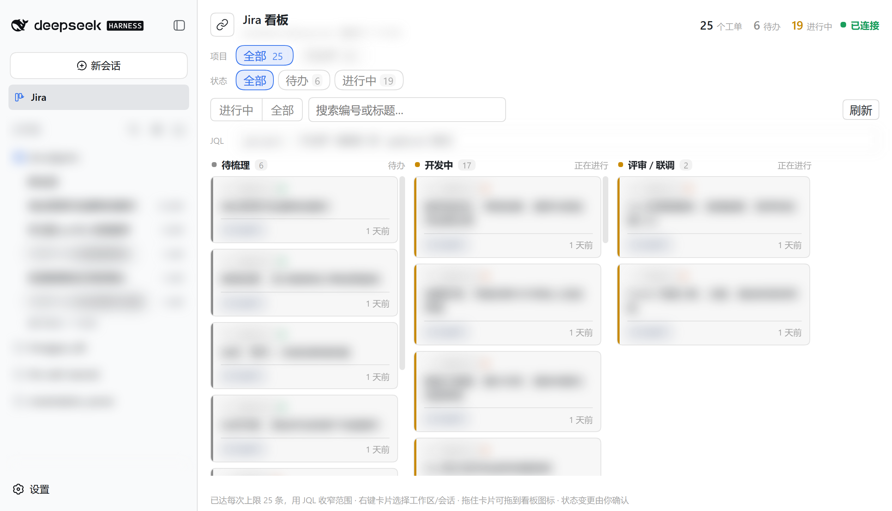
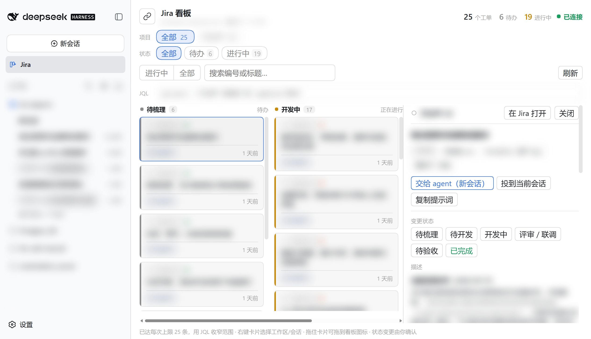
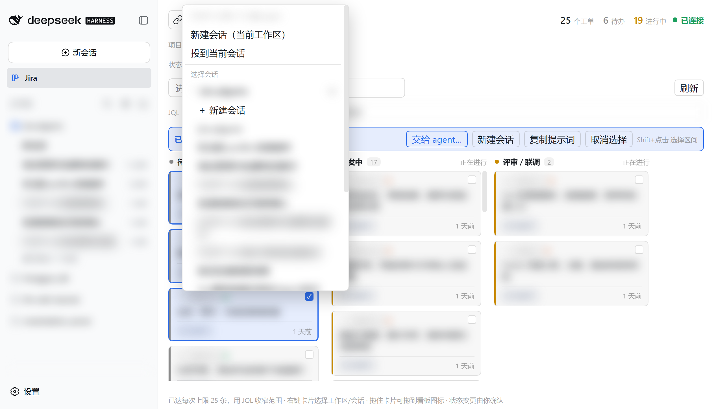
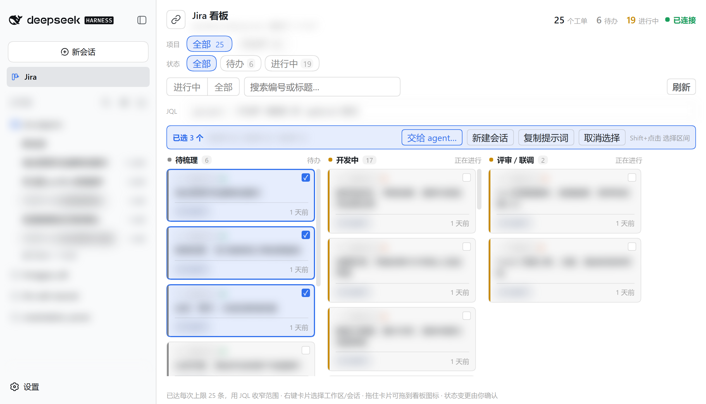

# dsh-plugin-atlassian

[](LICENSE)

**中文** · [English](README.en.md)

把 **Atlassian 官方远程 MCP 服务器**接入 [DeepSeek Harness](https://www.npmjs.com/package/@deepseek-ai/dsh)。
一次浏览器授权后，Jira、Confluence、Jira Service Management、Bitbucket 与 Compass 的工具会作为
原生工具出现在 agent 的工具列表里：

```
mcp__atlassian__getJiraIssue
mcp__atlassian__createJiraIssue
mcp__atlassian__searchConfluenceUsingCql
```


DSH 自带的 `dsh-mcp-client` 不支持 OAuth；改用 API token 则每次工具调用都要显式传 `cloudId`。
这个插件走 OAuth 2.1 补上这一段——站点由授权决定，不需要传 `cloudId`。

## 安装

```sh
dsh plugin --profile desktop add github:zhenyong97/dsh-plugin-atlassian
```

装完**重启该 profile**。把 `desktop` 换成你实际使用的 profile 名。

## 连接 Atlassian

1. 打开 **设置 → Atlassian**
2. 点 **连接 Atlassian**
3. 在 Atlassian 授权页**选择要授权的站点**并批准
4. 状态变为 **已连接**，设置页同时列出站点与可用工具数


本页开头那张设置页就是连上之后的样子：站点那一行是你在授权时选中的站点，可用工具 32 个。授权页
没有自动打开时，设置页会显示一条可点击的授权链接。卡住就点 **断开连接** 再重连一次。

连上之后，直接对 agent 说人话就行：

- 「列出 PROJ 项目里分配给我的、还没关闭的工单」
- 「把这段需求拆成 5 个子任务，挂到 PROJ-123 下面」
- 「把这次会议的结论写成 Confluence 页面，放到 Engineering 空间」
- 「搜一下 Confluence 里带 release-notes 标签的页面，汇总成本周发布说明」

## 操作方式

### 1. 打开 Jira 看板

授权完成后，侧边栏会多出一个 Jira 图标，点它打开看板。它拉的正是同一条 MCP 连接，所以不需要
额外的 token 或 cloudId 配置：



- **按状态分列**。Jira 的每个状态就是一列，按状态类别（待办 → 进行中 → 完成）排序；同一类别
  内按名称排，所以刷新不会跳列。
- **按项目筛选**。项目芯片由当前查询实际返回的工单推导，每个都带数量——所以点下去不会落进空项目。
  再点一次取消，或用「清除筛选」一次复位。
- **按状态类别筛选**。待办 / 进行中 / 完成三个芯片同样带数量，与项目筛选是「与」的关系。
- **搜索框**在编号、标题、项目名里做子串匹配，纯客户端即时过滤，不产生请求。
- **视图切换**。「进行中」排除已完成工单（默认，避免长 backlog 把在办的埋掉），「全部」含已完成。
- **JQL 直接显示并可编辑**，回车生效——JQL 就是看板的真实状态，藏起来会让"工单数不对"看起来像
  bug；改过之后会出现「重置」回到所选视图。
- 卡片左侧的状态色条、底部的项目芯片，以及标题栏的总数 / 待办 / 进行中统计，都是一眼扫读用的。
- 看板每 60 秒自己刷新一次，页面不可见时跳过；底部会提示是否已到每次抓取上限。

### 2. 看图单详情，确认状态流转

**点任意卡片**，右侧打开抽屉：工单描述（Markdown 渲染）、优先级、负责人、项目，以及**服务端当前
提供的状态流转按钮**——按钮就是服务端返回的那几个，不会猜。抽屉头是吸顶的，长描述滚下去也够
得到按钮。



状态变更由你在抽屉里点确认，agent 那边被明确要求不要自行改工单状态。

### 3. 把工单交给 agent

**右键任意卡片**打开菜单，就地选择投递目标：



| 菜单项 | 行为 |
|---|---|
| **新建会话（当前工作区）** | 在当前/最近的工作区开新会话并投递 |
| **投到当前会话** | 排队投进已打开的那个会话，不打断它正在做的事 |
| **展开某个工作区 → ＋新建会话** | 在该工作区开新会话并投递 |
| **展开某个工作区 → 某个会话** | 投进那个已经存在的会话（进行中的排在前面） |
| **复制提示词** | 只复制到剪贴板，你自己决定贴到哪 |

投递后**停留在看板**，成功提示留在原地，你可以接着投下一批；目标会话在侧边栏一点就到。

指令模板来自 `board.promptTemplate`（`{{key}}` / `{{summary}}` 会被替换）。默认模板刻意写得有
约束：先读代码再动手、只改这个任务范围内、给出可复核证据，并且**明确要求 agent 不要自行变更
Jira 工单状态**——状态流转由你在看板上点确认。自定义模板是按单工单写的，批量投递时会每个工单
各生成一份。

### 4. 多选，一次投一批

`Shift+点击` 从上一张卡片开始选择区间（按你看到的左→右、上→下顺序）。一旦有选中，卡片上会出现
复选框，底部出现批量操作条：



可以一次把多个工单投给同一个会话或新建一个会话——多个工单会合成**一条**提示词，而不是互相穿插
的几条。

卡片也可以拖到侧边栏的看板图标上：落下来会选中拖动的那些工单并打开同一个菜单，由你确认目标。

## 会用到哪些工具

授权成功后，这些工具会以 `mcp__atlassian__<名称>` 出现在 agent 的工具列表里。实际可用的集合
取决于你在授权站点里有权限访问的产品：

| 工具 | 用途 |
|---|---|
| `searchJiraIssuesUsingJql` | 用 JQL 搜索工单 |
| `getJiraIssue` | 读取单个工单 |
| `createJiraIssue` | 新建工单 |
| `getVisibleJiraProjects` | 列出可见的 Jira 项目 |
| `getTransitionsForJiraIssue` | 查看某个工单可用的状态流转 |
| `searchConfluenceUsingCql` | 用 CQL 搜索 Confluence |
| `getConfluencePage` | 读取页面内容 |
| `createConfluencePage` / `updateConfluencePage` | 新建 / 更新页面 |
| `atlassianUserInfo` | 当前授权账号 |
| `getAccessibleAtlassianResources` | 该授权可访问的站点 |

## 配置

默认配置开箱可用，通常不需要改。要改就在你 profile 的 `cordis.patch.yml` 里按 `id: atlassian`
覆盖：

| 字段 | 默认值 | 含义 |
|---|---|---|
| `serverName` | `atlassian` | 工具名前缀：`mcp__<serverName>__<tool>` |
| `redirectPort` | `3334` | OAuth 回调端口，尽量保持不变 |
| `expectedSite` | 空 | 填了会在授权后校验站点，不一致时提示 |
| `autoOpenBrowser` | `true` | 点「连接 Atlassian」时自动打开浏览器 |
| `board.jql` | 空 | 看板打开的默认 JQL，留空用内置的「进行中」视图（排除已完成） |
| `board.limit` | `50` | 每次刷新的工单数上限（服务端单页最多 100） |
| `board.timeoutMs` | `90000` | 单次看板读取的超时 |
| `board.promptTemplate` | 空 | 交付给 agent 的指令模板，留空用内置模板 |

其余字段与完整默认值见 `cordis.patch.yml`。

> ⚠️ 补丁是**整体替换**该行的 `config`，不是合并，所以覆盖时其余字段也要照抄。

## 卸载

```sh
dsh plugin --profile desktop remove dsh-plugin-atlassian
```

授权信息存在 `$DSH_HOME/.dsh-atlassian/`，一并删除即可。

## 常见问题

<details>
<summary>设置里没有 Atlassian 页</summary>

该 profile 没有 web server 服务，或插件未随 profile 重启而生效。查启动日志里 `atlassian:`
前缀的告警。
</details>

<details>
<summary>状态停在「需要授权」/ 浏览器没打开</summary>

点设置页里的授权链接直接访问。若 `redirectPort` 被占用，插件会自动退回临时端口并重新注册。
流程彻底卡住时点 **断开连接** 清掉 token 再重连。
</details>

<details>
<summary>连接成功但工具数为 0</summary>

服务端没有返回工具，通常是站点权限问题——确认授权时选中的站点里有你期望访问的产品。
</details>

<details>
<summary>提示站点不匹配</summary>

你配的 `expectedSite` 与实际授权站点不一致。工具仍可用，只是指向设置页显示的那个站点。
改掉 `expectedSite` 或重新授权即可。**这是提示，不是阻断。**
</details>

## 已知限制

- 只桥接工具，MCP 的 Resources 与 Prompts 暂不支持
- 图片结果渲染为占位文本
- 设置页的导航图标是就地补丁（DSH 没提供图标接口），匹配不上时保持默认齿轮
- 未对 `expectedSite` 不匹配做硬阻断

## 开发

```sh
npm install && npm run build   # tsc(host) + tsc(client) + 打包 client bundle
```

在独立 profile 上验证、两个回归脚本，以及 README / 市场截图的抓取流程，见 `dev/README.md`。

## License

MIT
